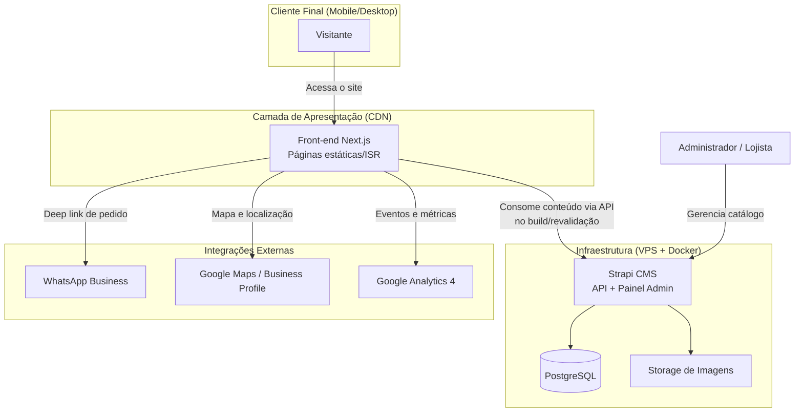

# Documento de Visão e Escopo (PRD)
## Site Institucional e Vitrine Digital — Floricultura Gypsophila

| Campo | Valor |
|---|---|
| **Projeto** | Site Floricultura Gypsophila |
| **Versão do documento** | 1.0 |
| **Status** | Rascunho para validação com o cliente |
| **Tipo** | Product Requirements Document (Visão e Escopo) |
| **Autor** | [Você] — Desenvolvedor / Tech Lead |
| **Cliente / Stakeholder** | Proprietário da Floricultura Gypsophila (Aldeota, Fortaleza/CE) |
| **Data** | Junho/2026 |

> Este documento é a **fonte da verdade** do projeto. Qualquer mudança de escopo deve ser refletida aqui e versionada (controle no Git). Decisões verbais que não constem neste documento não fazem parte do contrato de entrega.

---

## 1. Resumo Executivo e Objetivos de Negócio

### 1.1 Contexto
A Floricultura Gypsophila é uma marca tradicional de Fortaleza, com loja física na Aldeota e presença social estabelecida (mais de 6 mil seguidores no Instagram). Apesar da reputação consolidada no mundo físico, a empresa **não possui uma presença digital própria**: depende exclusivamente do Instagram e do boca a boca. Isso gera três perdas concretas:

- **Invisibilidade na busca:** quando um cliente pesquisa "floricultura em Fortaleza" ou "comprar flores Aldeota" no Google, a Gypsophila não aparece de forma competitiva, cedendo terreno para marketplaces nacionais que sequer têm loja física na cidade.
- **Fricção no atendimento:** todo o fluxo de catálogo, dúvida e pedido acontece de forma manual e não escalável via direct/comentários.
- **Déficit de credibilidade formal:** a ausência de site próprio enfraquece a percepção de profissionalismo frente a clientes corporativos e de eventos.

### 1.2 Problema a ser resolvido
> Traduzir a reputação física já existente da Gypsophila para o ambiente digital, transformando o site em um **canal de captação de demanda local** (via SEO) e em uma **vitrine de conversão** que direciona o cliente para o atendimento humano de forma rápida e escalável.

### 1.3 Objetivos de Negócio
1. **Capturar demanda de busca local** que hoje é perdida para concorrentes nacionais.
2. **Reduzir a fricção** entre a descoberta do produto e o início da negociação de compra.
3. **Reforçar a credibilidade** institucional da marca (tradição, prêmios, loja física).
4. **Criar um ativo digital escalável e de baixo custo operacional**, gerenciável pelo próprio lojista no dia a dia.

### 1.4 Indicadores de Sucesso (KPIs)
Os indicadores abaixo definem como mediremos se o site cumpriu seu papel. As metas são referência inicial e devem ser revisadas após 90 dias de operação.

| KPI | Métrica | Meta de referência (90 dias) | Ferramenta |
|---|---|---|---|
| **Visibilidade local** | Posição no Google para termos locais ("floricultura Aldeota", "flores Fortaleza entrega") | Aparecer na 1ª página / Local Pack | Google Search Console |
| **Conversão primária** | Cliques no botão "Pedir pelo WhatsApp" | ≥ 8% das sessões | GA4 / evento customizado |
| **Tráfego orgânico** | Sessões oriundas de busca orgânica | Crescimento mês a mês | GA4 |
| **Performance** | Core Web Vitals em mobile (LCP, INP, CLS) | "Good" em todas as métricas | PageSpeed / CrUX |
| **Autonomia do lojista** | Nº de chamados de suporte ao desenvolvedor para tarefas de catálogo | Tendência a zero após treinamento | Acompanhamento qualitativo |

> **Nota estratégica:** a conversão primária deste MVP **não é uma venda automatizada no site**, e sim o **clique qualificado para o WhatsApp**. A venda é fechada no atendimento humano, que é o principal diferencial competitivo da loja física.

---

## 2. Definição de Escopo

### 2.1 In Scope (MVP — Versão 1.0)
O que **será** entregue nesta primeira versão:

- Site responsivo (mobile-first), institucional e de vitrine.
- Catálogo de produtos dinâmico, gerenciável pelo lojista por painel administrativo.
- Organização do catálogo por categorias (buquês, arranjos, cestas, coroas).
- Página de produto individual com foto, descrição e preço.
- **Checkout via WhatsApp** (botão com mensagem pré-preenchida, por produto e global).
- Páginas institucionais: Home, Sobre, Como Comprar, Contato e Localização.
- Landing de captação para Decoração de Eventos com formulário de orçamento.
- SEO Local técnico: schema markup (`LocalBusiness`/`Florist`), metadados, sitemap, URLs amigáveis.
- Integração visual com Google Maps e dados NAP (Nome, Endereço, Telefone) consistentes.
- Infraestrutura segura (HTTPS, headers de segurança, hardening do servidor).
- Painel administrativo amigável para gestão de produtos, categorias e banners de datas comemorativas.
- Treinamento do lojista para operação do painel (handoff documentado).

### 2.2 Out of Scope (NÃO será feito no MVP)
Explicitamente fora desta versão, para preservar foco, prazo e orçamento. Itens podem entrar em versões futuras:

- **Carrinho de compras e checkout com pagamento online** (PIX/cartão/gateway). O fechamento ocorre via WhatsApp.
- **Cálculo automático de frete / integração com transportadoras.**
- **Cadastro e login de clientes / área do cliente.**
- **Programa de fidelidade, cupons ou descontos automáticos.**
- **Gestão de estoque em tempo real / integração com ERP ou sistema de PDV.**
- **Blog e produção de conteúdo editorial** (planejado para fase posterior).
- **Aplicativo móvel nativo.**
- **Múltiplos idiomas / internacionalização.**
- **Emissão fiscal (NF-e) e back-office financeiro.**

> Documentar o *Out of Scope* é tão importante quanto o *In Scope*: é o que previne o "scope creep" — o crescimento silencioso de pedidos que descaracteriza o prazo e o orçamento combinados.

---

## 3. Requisitos Funcionais (RF)

Os requisitos abaixo descrevem **o que o sistema deve fazer**. Cada item inclui ator, descrição e critérios de aceite resumidos.

### 3.1 Visitante (cliente final)

**RF-001 — Visualização do catálogo**
O visitante deve poder navegar pelo catálogo de produtos, com listagem por categoria.
*Aceite:* produtos exibidos com imagem, nome e preço; filtragem por categoria funcional; paginação ou carregamento incremental quando o volume exigir.

**RF-002 — Página de produto**
O visitante deve poder acessar a página individual de um produto.
*Aceite:* exibe imagem em alta, nome, descrição, preço e CTA de WhatsApp; URL amigável e indexável (ex.: `/produto/buque-rosas-vermelhas`).

**RF-003 — Pedido via WhatsApp**
O visitante deve poder iniciar um pedido de qualquer produto via WhatsApp.
*Aceite:* o botão abre o WhatsApp (web/app) com número comercial e mensagem pré-preenchida contendo a identificação do produto (ex.: *"Olá! Tenho interesse no produto: Buquê de Rosas Vermelhas"*).

**RF-004 — Navegação institucional**
O visitante deve acessar as páginas Sobre, Como Comprar e Contato/Localização.
*Aceite:* conteúdo institucional renderizado; página de contato exibe mapa incorporado, horário de funcionamento, telefones e WhatsApp.

**RF-005 — Solicitação de orçamento para eventos**
O visitante interessado em decoração de eventos deve poder enviar uma solicitação de orçamento.
*Aceite:* formulário com campos essenciais (nome, contato, tipo de evento, data, mensagem); proteção anti-spam (honeypot/validação); envio confirmado com feedback visual.

**RF-006 — Acesso a destaques e datas comemorativas**
O visitante deve visualizar destaques sazonais na Home (ex.: Dia das Mães, Namorados, Finados).
*Aceite:* banner/seção de destaque controlável pelo lojista, sem necessidade de deploy.

### 3.2 Administrador (lojista)

**RF-101 — Gestão de produtos (CRUD)**
O lojista deve poder criar, editar, publicar/despublicar e remover produtos.
*Aceite:* upload de imagem; campos de nome, descrição, preço, categoria e disponibilidade; operação realizável pelo celular sem suporte técnico.

**RF-102 — Gestão de categorias**
O lojista deve poder organizar produtos em categorias.
*Aceite:* criar/editar categorias e associar produtos.

**RF-103 — Gestão de banners/destaques sazonais**
O lojista deve poder atualizar a comunicação de datas comemorativas.
*Aceite:* trocar imagem/texto do destaque da Home de forma autônoma.

**RF-104 — Gestão de conteúdo institucional**
O lojista deve poder editar textos e dados de contato das páginas institucionais.
*Aceite:* edição de horários, telefones e textos sem intervenção do desenvolvedor.

**RF-105 — Autenticação segura**
O acesso ao painel deve ser restrito e autenticado.
*Aceite:* login protegido por senha forte; sessão segura; (desejável) autenticação em duas etapas.

---

## 4. Requisitos Não Funcionais (NFR)

Definem **como** o sistema deve se comportar — atributos de qualidade. São diretrizes vinculantes de engenharia.

### 4.1 Performance
- **RNF-001:** As páginas de catálogo e produto devem ser servidas de forma estática/pré-renderizada (SSG/ISR), com revalidação incremental ao publicar conteúdo.
- **RNF-002:** Core Web Vitals na faixa "Good" em dispositivos móveis (LCP < 2,5s, INP < 200ms, CLS < 0,1).
- **RNF-003:** Imagens otimizadas e servidas em formato moderno (WebP/AVIF), com `lazy loading` e dimensionamento responsivo.

### 4.2 Escalabilidade
- **RNF-004:** A camada de apresentação (front-end) deve ser distribuída via CDN, suportando picos de tráfego sazonais (datas comemorativas) sem degradação.
- **RNF-005:** A arquitetura deve ser **headless e desacoplada**, permitindo evoluir o front-end ou substituir a camada de apresentação sem reescrever o back-end — e vice-versa.
- **RNF-006:** O modelo de dados deve comportar a futura inclusão de um módulo de e-commerce (carrinho/pagamento) sem refatoração estrutural.

### 4.3 Manutenibilidade
- **RNF-007:** O lojista deve operar o catálogo de forma 100% autônoma após o treinamento, sem dependência do desenvolvedor para tarefas rotineiras.
- **RNF-008:** Código versionado em Git, com convenções de commit e documentação de setup (README) que permitam a um terceiro subir o ambiente local.
- **RNF-009:** Separação clara de responsabilidades: conteúdo (CMS) desacoplado de apresentação (front-end) e de configuração (variáveis de ambiente).
- **RNF-010:** Configurações sensíveis externalizadas em variáveis de ambiente — nenhum segredo versionado no repositório.

### 4.4 Segurança (DevSecOps)
- **RNF-011:** Tráfego exclusivamente sob HTTPS, com redirecionamento forçado e HSTS.
- **RNF-012:** Headers de segurança aplicados (Content-Security-Policy, X-Content-Type-Options, X-Frame-Options, Referrer-Policy).
- **RNF-013:** Endpoint administrativo protegido (rota não óbvia, rate limiting, política de senha forte).
- **RNF-014:** *Rate limiting* na API para mitigar abuso e ataques de força bruta.
- **RNF-015:** Servidor com hardening: firewall ativo, acesso por usuário não-root, atualização de pacotes e dependências.
- **RNF-016:** **Backup automatizado** do banco de dados (rotina agendada + retenção), com procedimento de restauração testado.
- **RNF-017:** Pipeline CI/CD com etapas de lint, build e (idealmente) análise de dependências/segurança antes do deploy.

### 4.5 Disponibilidade e Observabilidade
- **RNF-018:** Monitoramento de uptime com alerta em caso de indisponibilidade.
- **RNF-019:** Analytics de uso (GA4 ou alternativa privacy-friendly) configurado, com evento de conversão de WhatsApp instrumentado.

### 4.6 SEO e Acessibilidade
- **RNF-020:** Marcação semântica + schema markup `LocalBusiness`/`Florist` válido (Rich Results Test).
- **RNF-021:** `sitemap.xml` e `robots.txt` gerados e submetidos ao Search Console.
- **RNF-022:** Boas práticas de acessibilidade (contraste, textos alternativos em imagens, navegação por teclado).

---

## 5. Estrutura Macro da Arquitetura

A solução adota uma **arquitetura headless desacoplada**: a camada de conteúdo (CMS/back-end) é independente da camada de apresentação (front-end), comunicando-se via API. Essa separação atende diretamente a NFR-005, NFR-006 e NFR-009.

### 5.1 Componentes

| Componente | Tecnologia de referência | Responsabilidade |
|---|---|---|
| **Front-end** | Next.js (React) — SSG/ISR, hospedado em CDN | Renderiza a vitrine, gera páginas estáticas, consome a API do CMS, instrumenta SEO e analytics. |
| **CMS / Back-end** | Strapi (Node, self-hosted) | Painel administrativo amigável, modelo de conteúdo, autenticação, exposição da API REST/GraphQL. |
| **Banco de Dados** | PostgreSQL | Persistência de produtos, categorias, páginas e configurações. |
| **Mídia** | Storage de objetos / volume do servidor | Armazenamento de imagens dos produtos. |
| **Integrações externas** | WhatsApp (deep link), Google Maps (embed), Google Business Profile, GA4 | Conversão, localização, presença local e métricas. |
| **Infraestrutura** | VPS (Docker + Nginx + HTTPS) para o back-end; CDN para o front-end | Hospedagem, isolamento, segurança e distribuição. |

### 5.2 Fluxo de interação (visão conceitual)

### 5.3 Princípio arquitetural central
O front-end **não acessa o banco diretamente**: toda a leitura de conteúdo passa pela API do CMS, preferencialmente em tempo de build/revalidação (não a cada requisição do usuário). Isso garante performance (RNF-001/002), reduz superfície de ataque (a vitrine pública não tem credenciais de banco) e mantém o desacoplamento que viabiliza a evolução futura para e-commerce completo.

---

## 6. Fases de Entrega (Milestones)

Divisão lógica do projeto em marcos verificáveis. Cada milestone tem um critério de "pronto" (Definition of Done) que destrava o seguinte.

### Milestone 0 — Descoberta e Fundação
**Objetivo:** reunir os insumos sem os quais o site não pode ser preenchido.
**Entregáveis:** catálogo real de produtos, fotos em alta resolução, faixas de preço, política de entrega, número de WhatsApp comercial, definição de identidade visual.
**DoD:** insumos coletados e aprovados pelo cliente; este PRD validado e assinado.

### Milestone 1 — Setup Técnico e Infraestrutura
**Objetivo:** ambiente de desenvolvimento e produção operacional e seguro.
**Entregáveis:** repositório Git; CMS + PostgreSQL em contêiner; modelagem dos *content types*; VPS provisionado com Docker, Nginx, HTTPS, firewall e usuário não-root.
**DoD:** ambiente local reproduzível; servidor acessível via HTTPS; backups configurados.

### Milestone 2 — Desenvolvimento do Front-end (Vitrine)
**Objetivo:** implementar a experiência do visitante.
**Entregáveis:** Home → Catálogo → Página de produto → Contato (nessa ordem de prioridade); componentes reutilizáveis; integração de WhatsApp; SEO técnico aplicado desde o início.
**DoD:** RF-001 a RF-006 implementados e navegáveis com dados de teste.

### Milestone 3 — Painel, Conteúdo e SEO Local
**Objetivo:** tornar o site gerenciável e encontrável.
**Entregáveis:** painel administrativo validado (RF-101 a RF-105); catálogo real cadastrado pelo lojista (primeira vez acompanhada); Google Business Profile otimizado; schema markup validado; sitemap submetido ao Search Console.
**DoD:** lojista cadastra um produto sem ajuda; rich results válidos; site indexável.

### Milestone 4 — Testes e QA
**Objetivo:** garantir qualidade funcional, de performance e de segurança.
**Entregáveis:** testes funcionais (links de WhatsApp, formulários); auditoria de performance (Lighthouse ≥ 90 mobile); validação de headers de segurança; scan básico de vulnerabilidades; testes cross-device reais (Android/iOS).
**DoD:** NFRs de performance e segurança verificados; bugs críticos zerados.

### Milestone 5 — Deploy e Go-Live
**Objetivo:** colocar o site em produção de forma confiável.
**Entregáveis:** front-end em CDN com deploy automático via Git; back-end em produção no VPS; domínio apontado; SSL ponta a ponta; pipeline CI/CD ativo; backup automatizado verificado.
**DoD:** site público, estável e monitorado.

### Milestone 6 — Handoff e Pós-Lançamento
**Objetivo:** transferir a operação ao lojista e estabelecer manutenção.
**Entregáveis:** treinamento + vídeo curto de operação do painel; monitoramento de uptime e analytics ativos; definição formal do contrato de manutenção (cortesia, troca ou pago).
**DoD:** cliente operando de forma autônoma; acordo de manutenção formalizado.

---

## 7. Premissas e Dependências

- O cliente fornecerá conteúdo (fotos, textos, preços) em tempo hábil — o atraso na entrega de insumos é o principal risco de cronograma.
- A loja possui um número de WhatsApp Business dedicado ao atendimento.
- Os preços do catálogo são relativamente estáveis ou serão mantidos pelo próprio lojista via painel.
- Custos recorrentes de infraestrutura (domínio, VPS) são de responsabilidade do cliente e devem ser acordados antes do go-live.

## 8. Riscos e Mitigações

| Risco | Impacto | Mitigação |
|---|---|---|
| Atraso na entrega de conteúdo pelo cliente | Trava o cronograma | Definir Milestone 0 como pré-requisito formal; cobrar insumos antecipadamente. |
| Scope creep (pedidos fora do MVP) | Estoura prazo/orçamento | Apoiar-se na seção *Out of Scope*; tratar novos pedidos como versão 2.0. |
| Baixa adesão do lojista ao painel | Site desatualizado | Priorizar usabilidade do CMS e treinamento prático no Milestone 3/6. |
| Projeto "de amigo" sem combinado de manutenção | Dívida de trabalho não remunerado | Formalizar contrato de manutenção no Milestone 6. |

---

*Fim do documento — Versão 1.0. Alterações futuras devem incrementar a versão e registrar o histórico de mudanças.*
