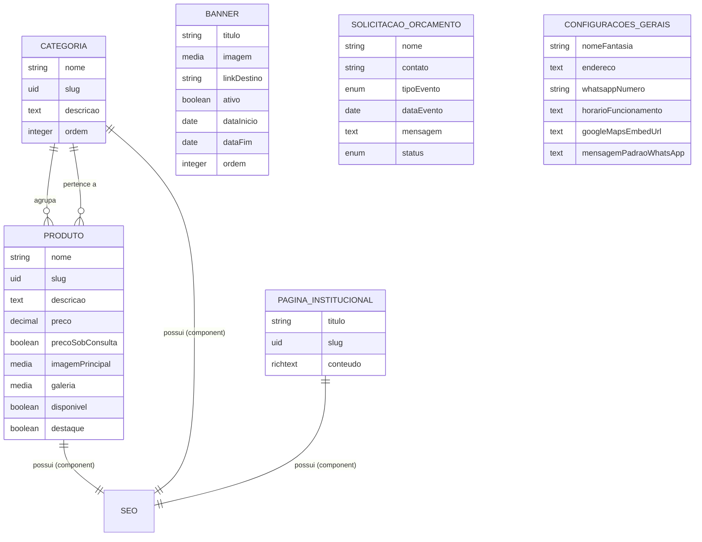

# Modelagem da Camada de Dados — Content Types (Strapi)
## Site Floricultura Gypsophila

| Campo | Valor |
|---|---|
| **Projeto** | Site Floricultura Gypsophila |
| **Documento** | Modelagem de dados / Content Types |
| **Versão** | 1.0 |
| **Base** | PRD v1.0 (rastreabilidade por IDs de RF) |
| **CMS alvo** | Strapi (self-hosted) + PostgreSQL |
| **Status** | Proposta para implementação no Milestone 1 |

> Este documento é o elo entre o PRD e o código. Cada entidade e campo aponta para o(s) Requisito(s) Funcional(is) que justifica(m) sua existência. Nada aqui é "campo por garantia" — se um atributo não serve a um RF, ele não entra no MVP (princípio anti-inchaço, ligado ao RNF-007).

---

## 1. Visão Geral do Modelo

O domínio é enxuto e foi desenhado para que o lojista o opere sem treinamento técnico. São **quatro Collection Types**, **um Single Type** e **um Component reutilizável**.

| Entidade | Tipo no Strapi | Propósito | RFs atendidos |
|---|---|---|---|
| **Categoria** | Collection Type | Agrupar produtos (buquês, arranjos, cestas, coroas) | RF-001, RF-102 |
| **Produto** | Collection Type | Item do catálogo (vitrine) | RF-001, RF-002, RF-003, RF-101 |
| **Banner** | Collection Type | Destaques sazonais da Home | RF-006, RF-103 |
| **Página Institucional** | Collection Type | Sobre, Como Comprar e similares | RF-004, RF-104 |
| **Solicitação de Orçamento** | Collection Type | Armazenar pedidos de eventos | RF-005 |
| **Configurações Gerais** | Single Type | Dados de contato, NAP e WhatsApp central | RF-003, RF-004, RF-104 |
| **SEO** | Component | Metadados reutilizáveis por página | RNF-020 |

### 1.1 Diagrama de relações



> O Single Type **Configurações Gerais** e a coleção **Solicitação de Orçamento** não têm relações estruturais com as demais entidades — por isso aparecem isolados no diagrama. São, respectivamente, configuração global e captura de formulário.

---

## 2. Decisões de Modelagem (e por quê)

Estas são as escolhas que merecem justificativa explícita, porque impactam as três camadas (banco, API e painel):

1. **Visibilidade vs. disponibilidade são conceitos separados.** Usamos o recurso nativo de *Draft & Publish* do Strapi para controlar se o produto **aparece no site** (atende ao publicar/despublicar do RF-101) e mantemos um booleano `disponivel` à parte para sinalizar **"temporariamente esgotado"**. Um produto pode estar publicado e indisponível — situações distintas que o lojista entende intuitivamente.

2. **O número de WhatsApp é centralizado no Single Type, nunca hardcoded.** O deep link do RF-003 é montado pelo front-end a partir de `Configurações Gerais.whatsappNumero`. Se o número mudar, o lojista altera em um único lugar, sem deploy (RNF-007) e sem segredo no código (RNF-010).

3. **`preco` é `decimal` acompanhado de `precoSobConsulta`.** A persona de condolências (coroas) e itens de evento frequentemente operam com "preço sob consulta". Modelar isso desde já evita gambiarra de cadastrar "R$ 0,00" e atende ao mundo real do negócio sem retrabalho futuro.

4. **`slug` (tipo `uid`) em Produto, Categoria e Página.** Gera URLs amigáveis e estáveis (RF-002) e sustenta a estratégia de SEO Local (RNF-020). O `slug` é derivado do nome, mas editável.

5. **SEO é um Component reutilizável, não campos soltos.** Reaproveitado em Produto, Categoria e Página Institucional. Mantém consistência e simplifica o painel (DRY aplicado a conteúdo).

6. **Solicitação de Orçamento é persistida, não só enviada por e-mail.** Armazenar a submissão com um campo `status` dá ao lojista um mini-CRM de eventos dentro do próprio painel, sem ferramenta externa. O e-mail de notificação continua sendo o gatilho de atendimento; o registro é o histórico.

---

## 3. Component Reutilizável: `shared.seo`

Aplicado como component (não repetível) nas entidades indexáveis.

| Campo | Tipo Strapi | Obrigatório | Regra | Observação |
|---|---|:---:|---|---|
| `metaTitle` | string | Não | máx. 60 caracteres | Título para mecanismos de busca |
| `metaDescription` | text | Não | máx. 160 caracteres | Resumo que aparece no Google |
| `metaImage` | media (single) | Não | apenas imagens | Open Graph / compartilhamento social |

---

## 4. Detalhamento das Entidades

### 4.1 Categoria  ·  *Collection Type*  ·  RF-001, RF-102

| Campo | Tipo Strapi | Obrigatório | Único | Regra / Default | RF |
|---|---|:---:|:---:|---|---|
| `nome` | string | Sim | Sim | — | RF-102 |
| `slug` | uid (target: `nome`) | Sim | Sim | URL amigável | RF-001 |
| `descricao` | text | Não | — | Texto introdutório da página de categoria | RF-001 |
| `ordem` | integer | Não | — | Default `0` — controla ordenação na vitrine | RF-001 |
| `produtos` | relation (1\:N → Produto) | — | — | Lado inverso da relação | RF-001 |
| `seo` | component (`shared.seo`) | Não | — | — | RNF-020 |

---

### 4.2 Produto  ·  *Collection Type*  ·  RF-001, RF-002, RF-003, RF-101

| Campo | Tipo Strapi | Obrigatório | Único | Regra / Default | RF |
|---|---|:---:|:---:|---|---|
| `nome` | string | Sim | — | — | RF-101 |
| `slug` | uid (target: `nome`) | Sim | Sim | URL amigável | RF-002 |
| `descricao` | richtext | Sim | — | — | RF-002 |
| `preco` | decimal | Condicional | — | Obrigatório se `precoSobConsulta = false` | RF-002 |
| `precoSobConsulta` | boolean | Sim | — | Default `false` | RF-002 |
| `imagemPrincipal` | media (single) | Sim | — | Apenas imagens | RF-002 |
| `galeria` | media (multiple) | Não | — | Apenas imagens | RF-002 |
| `categoria` | relation (N:1 → Categoria) | Sim | — | — | RF-001 |
| `disponivel` | boolean | Sim | — | Default `true` — sinaliza "esgotado" | RF-101 |
| `destaque` | boolean | Sim | — | Default `false` — exibe na Home | RF-006 |
| `seo` | component (`shared.seo`) | Não | — | — | RNF-020 |
| *(publicação)* | Draft & Publish nativo | — | — | Controla exibição no site | RF-101 |

> **Geração do link de WhatsApp (RF-003):** o front-end monta a URL combinando `Configurações Gerais.whatsappNumero` + um template com o `nome` do produto. O campo não é persistido no Produto — é derivado em tempo de renderização, evitando duplicação de dado.

---

### 4.3 Banner  ·  *Collection Type*  ·  RF-006, RF-103

| Campo | Tipo Strapi | Obrigatório | Regra / Default | RF |
|---|---|:---:|---|---|
| `titulo` | string | Não | Texto opcional sobre a imagem | RF-006 |
| `imagem` | media (single) | Sim | Apenas imagens | RF-103 |
| `linkDestino` | string | Não | URL ou slug de categoria para onde o banner aponta | RF-006 |
| `ativo` | boolean | Sim | Default `false` | RF-103 |
| `dataInicio` | date | Não | Início da campanha sazonal | RF-103 |
| `dataFim` | date | Não | Fim da campanha sazonal | RF-103 |
| `ordem` | integer | Não | Default `0` | RF-006 |

> As datas permitem ao lojista **programar** campanhas (Dia das Mães, Namorados, Finados). O front-end exibe apenas banners com `ativo = true` e dentro da janela de datas — reduzindo a manutenção manual nos picos de receita.

---

### 4.4 Página Institucional  ·  *Collection Type*  ·  RF-004, RF-104

| Campo | Tipo Strapi | Obrigatório | Único | Regra | RF |
|---|---|:---:|:---:|---|---|
| `titulo` | string | Sim | — | — | RF-004 |
| `slug` | uid (target: `titulo`) | Sim | Sim | URL amigável | RF-004 |
| `conteudo` | richtext (ou blocks) | Sim | — | Corpo editável (Sobre, Como Comprar) | RF-104 |
| `seo` | component (`shared.seo`) | Não | — | — | RNF-020 |

---

### 4.5 Solicitação de Orçamento  ·  *Collection Type*  ·  RF-005

| Campo | Tipo Strapi | Obrigatório | Regra / Default | RF |
|---|---|:---:|---|---|
| `nome` | string | Sim | — | RF-005 |
| `contato` | string | Sim | Telefone ou e-mail do solicitante | RF-005 |
| `tipoEvento` | enumeration | Não | `casamento`, `aniversario`, `corporativo`, `formatura`, `outro` | RF-005 |
| `dataEvento` | date | Não | — | RF-005 |
| `mensagem` | text | Não | — | RF-005 |
| `status` | enumeration | Sim | `novo`, `em_atendimento`, `concluido` — default `novo` | RF-005 |

> **Segurança do formulário:** a escrita nesta coleção parte do front-end via endpoint público restrito a `create`. Aplicar honeypot + rate limiting (RNF-014) e nunca expor `find`/`update` públicos. A leitura é exclusiva do painel autenticado (RF-105).

---

### 4.6 Configurações Gerais  ·  *Single Type*  ·  RF-003, RF-004, RF-104

| Campo | Tipo Strapi | Obrigatório | Regra | RF |
|---|---|:---:|---|---|
| `nomeFantasia` | string | Sim | — | RF-004 |
| `endereco` | text | Sim | Compõe o NAP (SEO Local) | RF-004 |
| `whatsappNumero` | string | Sim | Formato internacional (ex.: `5585XXXXXXXXX`) — fonte única do deep link | RF-003 |
| `horarioFuncionamento` | text | Sim | — | RF-004 |
| `googleMapsEmbedUrl` | text | Não | URL de incorporação do mapa | RF-004 |
| `mensagemPadraoWhatsApp` | text | Não | Template da mensagem pré-preenchida | RF-003 |
| `instagram` | string | Não | URL do perfil | RF-004 |
| `facebook` | string | Não | URL do perfil | RF-004 |

---

## 5. Schema de Referência (implementação)

A forma canônica de criar estes content types é pelo **Content-Type Builder** do Strapi. Os schemas abaixo servem como referência fiel do resultado esperado (arquivos `schema.json` gerados em `src/api/<entidade>/content-types/<entidade>/`). Revise contra a versão do Strapi em uso antes de versionar.

### 5.1 Component `shared.seo`
`src/components/shared/seo.json`
```json
{
  "collectionName": "components_shared_seos",
  "info": { "displayName": "SEO", "icon": "search" },
  "options": {},
  "attributes": {
    "metaTitle": { "type": "string", "maxLength": 60 },
    "metaDescription": { "type": "text", "maxLength": 160 },
    "metaImage": { "type": "media", "multiple": false, "allowedTypes": ["images"] }
  }
}
```

### 5.2 Categoria
```json
{
  "kind": "collectionType",
  "collectionName": "categorias",
  "info": { "singularName": "categoria", "pluralName": "categorias", "displayName": "Categoria" },
  "options": { "draftAndPublish": true },
  "attributes": {
    "nome": { "type": "string", "required": true, "unique": true },
    "slug": { "type": "uid", "targetField": "nome", "required": true },
    "descricao": { "type": "text" },
    "ordem": { "type": "integer", "default": 0 },
    "produtos": {
      "type": "relation",
      "relation": "oneToMany",
      "target": "api::produto.produto",
      "mappedBy": "categoria"
    },
    "seo": { "type": "component", "repeatable": false, "component": "shared.seo" }
  }
}
```

### 5.3 Produto
```json
{
  "kind": "collectionType",
  "collectionName": "produtos",
  "info": { "singularName": "produto", "pluralName": "produtos", "displayName": "Produto" },
  "options": { "draftAndPublish": true },
  "attributes": {
    "nome": { "type": "string", "required": true },
    "slug": { "type": "uid", "targetField": "nome", "required": true },
    "descricao": { "type": "richtext", "required": true },
    "preco": { "type": "decimal" },
    "precoSobConsulta": { "type": "boolean", "default": false, "required": true },
    "imagemPrincipal": { "type": "media", "multiple": false, "required": true, "allowedTypes": ["images"] },
    "galeria": { "type": "media", "multiple": true, "allowedTypes": ["images"] },
    "disponivel": { "type": "boolean", "default": true, "required": true },
    "destaque": { "type": "boolean", "default": false, "required": true },
    "categoria": {
      "type": "relation",
      "relation": "manyToOne",
      "target": "api::categoria.categoria",
      "inversedBy": "produtos"
    },
    "seo": { "type": "component", "repeatable": false, "component": "shared.seo" }
  }
}
```

### 5.4 Banner
```json
{
  "kind": "collectionType",
  "collectionName": "banners",
  "info": { "singularName": "banner", "pluralName": "banners", "displayName": "Banner" },
  "options": { "draftAndPublish": false },
  "attributes": {
    "titulo": { "type": "string" },
    "imagem": { "type": "media", "multiple": false, "required": true, "allowedTypes": ["images"] },
    "linkDestino": { "type": "string" },
    "ativo": { "type": "boolean", "default": false, "required": true },
    "dataInicio": { "type": "date" },
    "dataFim": { "type": "date" },
    "ordem": { "type": "integer", "default": 0 }
  }
}
```

### 5.5 Página Institucional
```json
{
  "kind": "collectionType",
  "collectionName": "paginas",
  "info": { "singularName": "pagina", "pluralName": "paginas", "displayName": "Página Institucional" },
  "options": { "draftAndPublish": true },
  "attributes": {
    "titulo": { "type": "string", "required": true },
    "slug": { "type": "uid", "targetField": "titulo", "required": true },
    "conteudo": { "type": "richtext", "required": true },
    "seo": { "type": "component", "repeatable": false, "component": "shared.seo" }
  }
}
```

### 5.6 Solicitação de Orçamento
```json
{
  "kind": "collectionType",
  "collectionName": "solicitacoes_orcamento",
  "info": { "singularName": "solicitacao-orcamento", "pluralName": "solicitacoes-orcamento", "displayName": "Solicitação de Orçamento" },
  "options": { "draftAndPublish": false },
  "attributes": {
    "nome": { "type": "string", "required": true },
    "contato": { "type": "string", "required": true },
    "tipoEvento": { "type": "enumeration", "enum": ["casamento", "aniversario", "corporativo", "formatura", "outro"] },
    "dataEvento": { "type": "date" },
    "mensagem": { "type": "text" },
    "status": { "type": "enumeration", "enum": ["novo", "em_atendimento", "concluido"], "default": "novo", "required": true }
  }
}
```

### 5.7 Configurações Gerais (Single Type)
```json
{
  "kind": "singleType",
  "collectionName": "configuracoes_gerais",
  "info": { "singularName": "configuracao-geral", "pluralName": "configuracoes-gerais", "displayName": "Configurações Gerais" },
  "options": { "draftAndPublish": false },
  "attributes": {
    "nomeFantasia": { "type": "string", "required": true },
    "endereco": { "type": "text", "required": true },
    "whatsappNumero": { "type": "string", "required": true },
    "horarioFuncionamento": { "type": "text", "required": true },
    "googleMapsEmbedUrl": { "type": "text" },
    "mensagemPadraoWhatsApp": { "type": "text" },
    "instagram": { "type": "string" },
    "facebook": { "type": "string" }
  }
}
```

---

## 6. Notas de Permissão e Segurança da API

Pré-condição do Milestone 1 e ligação direta com os NFRs de segurança:

- **Acesso público (Public role):** apenas `find`/`findOne` em Produto, Categoria, Banner, Página Institucional e Configurações Gerais; e `create` em Solicitação de Orçamento. Nada além disso (RNF-013).
- **Escrita restrita:** todo `create`/`update`/`delete` de catálogo exige autenticação no painel (RF-105).
- **Rate limiting** no endpoint público de orçamento (RNF-014) + honeypot no formulário.
- **Token de API** (read-only) para o front-end consumir o conteúdo no build/revalidação, armazenado como variável de ambiente (RNF-010).

---

## 7. Próximo Passo Sugerido

Com o modelo definido, o caminho natural é o **Milestone 1 (Setup Técnico e Infraestrutura)**: subir Strapi + PostgreSQL via Docker Compose e materializar estes content types. O artefato seguinte coerente seria o **`backend/docker-compose.yml`** com hardening de segurança (rede isolada, variáveis de ambiente, volume persistente para o banco e rotina de backup) — onde seu perfil de DevSecOps começa a aparecer no projeto.

---

*Fim do documento — Modelagem v1.0. Alterações devem incrementar a versão e ser refletidas no PRD quando impactarem requisitos.*